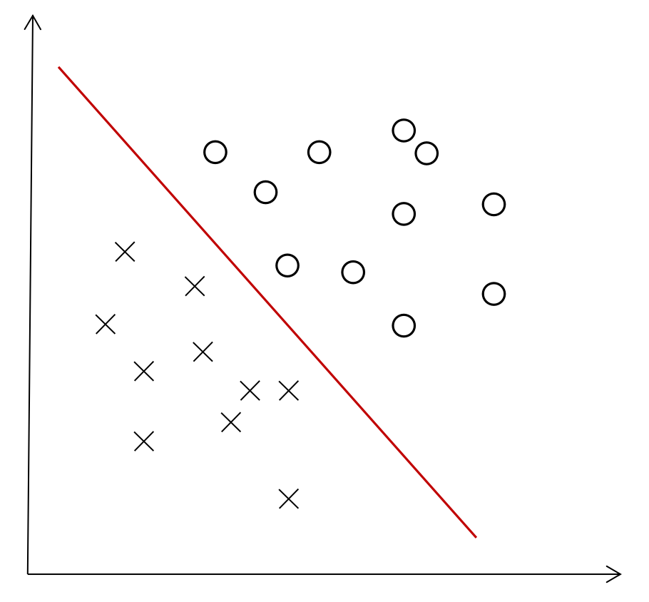
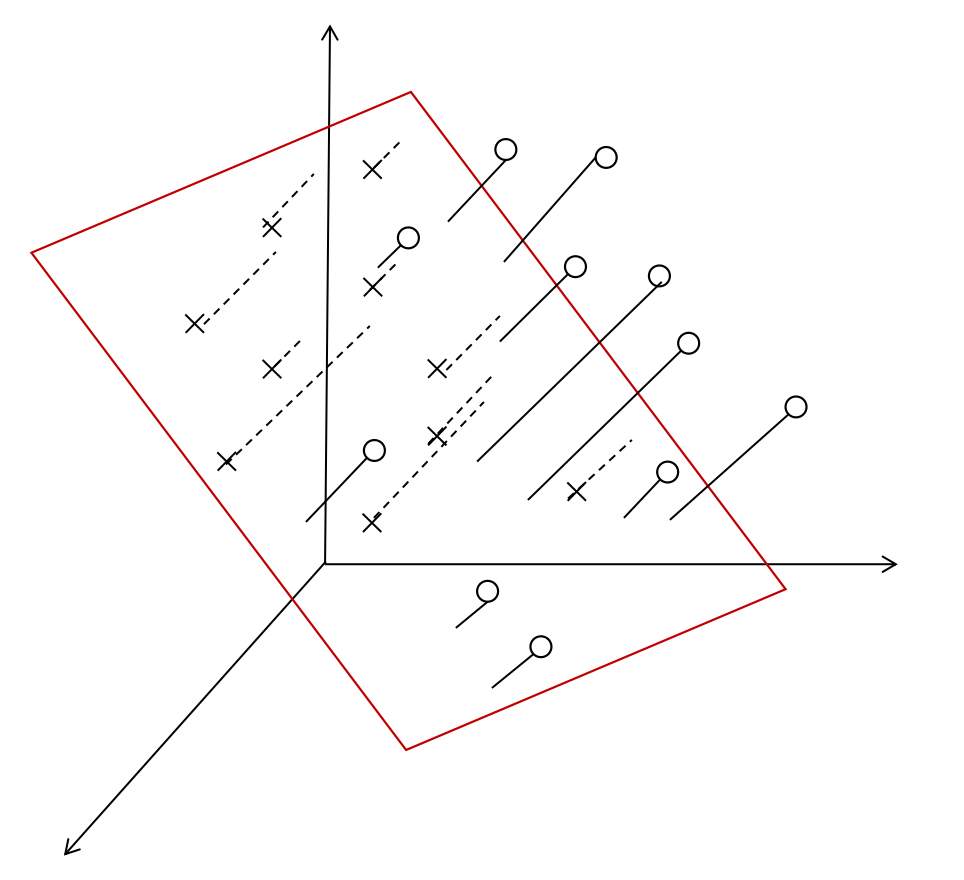
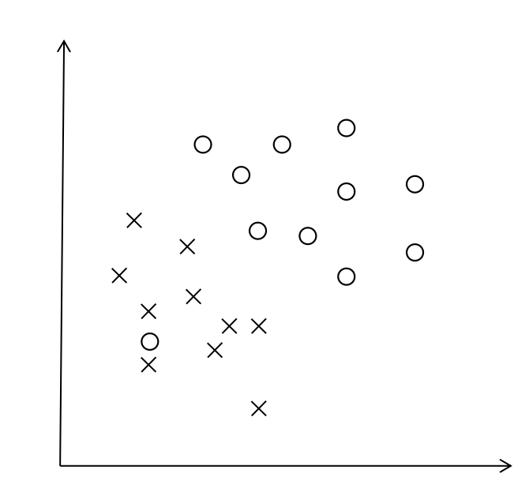
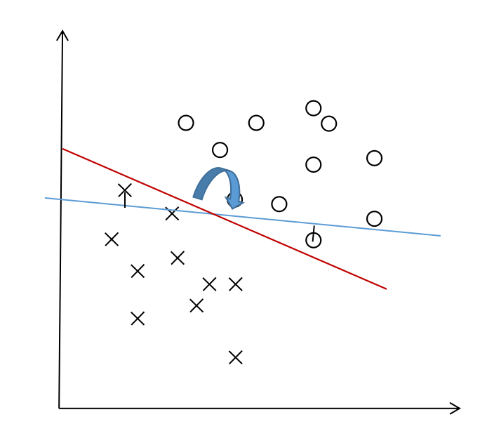

# 感知机

## 1. 直观解释

我们常常听到感知机（perceptron）这个概念，那么到底什么是感知机？感知机的作用又是什么？首先我们来看下面两个例子：

<center class="half">
    
    
</center>

左图是一个二维平面中，现有两种类型的点，我们需要找到一条直线来将这两种类型的点完全分开，即在这条找到的红线上方均为“O”点而直线下方均为“X”点；类似的，在右图展示的三维空间中，我们需要找到一个平面来完全分开这两类点。

**感知机其实就是找出空间上的一个超平面来正确划分给定的线性可分的二分类数据集**。这里补充两个概念：

- 超平面

  n维空间中n-1维的平面即这个n维空间的超平面。例如一个点`x=b`就是一条直线（1维）上的一个超平面；一条直线`y=kx+b`（1维）就是二维平面（2维）里的一个超平面；一个平面`z=ax+by+c`（2维）就是三维空间（3维）中的一个超平面；以此类推。

- 线性可分

  例如下图（相比上面的例子有一个“O”点跑到了左下角），我们就无法找到一个超平面来正确划分所有数据点。二分类数据集若可以找到一个超平面正确划分所有数据点，则这个数据集线性可分。
  
  <center>
  		
  </center>

通过上面的例子，我们还可以直观地看到，线性可分数据集上能正确划分的超平面**存在且不止一个**，这一点将在后面再次被提到。

## 2. 原理描述

### 1）映射函数

现在，感知机的作用我们大致了解了，问题是如何把上面这些文字描述（例如“超平面”）转化成后续可分析可优化求解的模型。

首先，一般二分类问题的正负样本我们可以用`+1`和`-1`来标记。假设我们已经找到了这样的分离超平面`wx+b=0`，那么为了让结果取值为`{+1, -1}`，自然而然地我们就会想到用`sign`函数：
$$
\text{sign}(x)=
  \begin{cases}
    +1& x\geq 0\\
    -1& x<0
  \end{cases}
$$
这样，感知机就可以表示为
$$
f(x)=\text{sign}(w\cdot x+b)
$$
其中 $$\cdot$$ 表示向量内积。也就是说，给出m维空间上的一个样本点$$x_i=(x_{11}, x_{i2},\cdots,x_{im})$$，通过感知机可以知道这个点标签是`+1`还是`-1`，获得这个点的分类，即通过上述映射函数将m维空间的点映射到`{+1, -1}`上。

### 2）目标函数

有了上述的映射关系后，我们回到最初的目的：找到一个分离超平面将样本正确分类，即找到合适的参数`w`和`b`，使得错误分类尽可能少。如果我们直接将目标描述成误分类点个数尽可能少，由于个数的表达不连续不可导，我们可以转换成另一种思路：让**误分类点到超平面`S`的总距离和最小**。这个思路怎么理解呢？可以看下面的例子：

<center>
		
</center>

原来的蓝色超平面有两个误分类点，为了让误分类点到超平面的距离和尽可能小，这个超平面就会趋向于顺时针旋转，演变成正确的红色超平面。

样本点$$(x_i, y_i)$$到超平面$$w\cdot x+b$$的距离可以表示为
$$
\frac{1}{\left\|w\right\|}|w\cdot x_i+b|
$$

其中$$\left\| \cdot \right\|$$表示二范数。对于误分类的点来说，$$w\cdot x_i+b>0$$ 时，有$$y_i=-1$$；$$w\cdot x_i+b<0$$ 时，有$$y_i=1$$，归纳来看就是
$$
-y_i(w\cdot x_i+b)>0
$$
因此误分类点到超平面的距离又可以表示为
$$
-\frac{1}{\left\|w\right\|}y_i(w\cdot x_i+b)
$$
由于$$\left\| w\right\|$$并不影响超平面的方向，我们可以不考虑$$-\frac{1}{\left\|w\right\|}$$这个因子，那么，若记所有误分类点的集合为`M`，则目标函数为
$$
\text{min}\quad L(w,b)=-\sum_{x_i\in M}y_i(w\cdot x_i+b) 
$$

### 3）优化算法

采用随机梯度下降法，随机取一个误分类点$$(x_i,y_i)$$，误分类点满足$$y_i(w\cdot x_i+b)\leq0$$，**注意有等号，等号的情况表示这个点在分离超平面上，由于是样本集线性可分，超平面一定能继续更新得到一个完全将样本分在超平面两侧的结果**。对于这个误分类点，产生的损失为
$$
L_i(w,b)=-y_i(w\cdot x_i+b)
$$
$$L_i(w,b)$$对`w`和`b`分别求梯度
$$
\frac{\partial L_i(w,b)}{\partial w}=-y_ix_i,\quad
\frac{\partial L_i(w,b)}{\partial b}=-y_i
$$
那么根据梯度下降法，设置学习率为$$\eta$$，则参数`w`和`b`可以进行下面的更新：
$$
w\leftarrow w+\eta y_ix_i,\quad b\leftarrow b+\eta y_i
$$
一直做上述的更新直到没有误分类点。

#### 例子：

现有一训练数据集，其中正样本点为$$x_1=(3,3)^\text{T},x_2=(4,3)^\text{T}$$，负样本点为$$x_3=(1,1)^\text{T}$$。用感知机算法求解示例过程如下：

1）初始化$$w=(w^{(1)},w^{(2)})^\text{T}=(0,0)^\text{T}$$，$$b=0$$，取学习率$$\eta=1$$

2）误分类点有$$x_1,x_2,x_3$$，从中随机选取$$x_1$$（因为$$y_i(w\cdot x_i+b)=1\times(0\times 3+0\times 3+0)=0$$）
$$
w=(0,0)^\text{T}+1\times 1\times (3,3)^\text{T}=(3,3)^\text{T},\quad
b=0+1\times 1=1
$$
3）此时误分类点只有$$x_3$$，继续梯度下降
$$
w=(3,3)^\text{T}-1\times 1\times (1,1)^\text{T}=(2,2)^\text{T},\quad
b=1-1\times 1=0
$$
4）此时误分类点仍只有$$x_3$$，继续梯度下降
$$
w=(2,2)^\text{T}-1\times 1\times (1,1)^\text{T}=(1,1)^\text{T},\quad
b=0-1\times 1=-1
$$
5）此时误分类点仍只有$$x_3$$，继续梯度下降
$$
w=(1,1)^\text{T}-1\times 1\times (1,1)^\text{T}=(0,0)^\text{T},\quad
b=-1-1\times 1=-2
$$
6）误分类点有$$x_1,x_2$$，从中随机选取$$x_1$$，更新参数
$$
w=(0,0)^\text{T}+1\times 1\times (3,3)^\text{T}=(3,3)^\text{T},\quad
b=-2+1\times 1=-1
$$
7）此时误分类点只有$$x_3$$，继续梯度下降
$$
w=(3,3)^\text{T}-1\times 1\times (1,1)^\text{T}=(2,2)^\text{T},\quad
b=-1-1\times 1=-2
$$
8）此时误分类点只有$$x_3$$，继续梯度下降
$$
w=(2,2)^\text{T}-1\times 1\times (1,1)^\text{T}=(1,1)^\text{T},\quad
b=-2-1\times 1=-3
$$
至此，全部点都分类正确，分离超平面为$$x^{(1)}+x^{(2)}-3=0$$，感知机模型为$$f(x)=\text{sign}(x^{(1)}+x^{(2)}-3)$$。这里我们也可以尝试不同的参数初始值，或者选取不同的误分类点，这些都可能导致最后的超平面不同，因此解不唯一。

引用一个结论：**对线性可分的数据集，感知机学习算法收敛**。对证明感兴趣的可以看一下李航的《统计学习方法》。

### 4）对偶形式

**为什么要提出对偶形式？**

上面的优化算法描述的是原始问题求解过程，接下来我们探讨感知机对偶问题。至于为什么要用对偶形式呢？我大致列出了下面两个原因：

- 当样本数量远小于样本维度时，求解对偶问题更简单；
- 对偶问题可以方便地加入核技巧。

对于第一点原因，通过前面原问题的求解，我们可以看到参数`w`是和样本特征维度相同的，在接下来叙述的对偶形式中我们将看到对偶形式的参数维度是和样本数量相同的，因此当样本数量远小于样本维度时，求解对偶问题更简单；对于第二点原因，我们将会在后期的SVM讲解中详细介绍。

从3）优化算法中可以看到，最终的`w`和`b`其实可以表示为$$x_i$$和$$y_i$$的线性组合。假设$$w$$初始化为零向量，$$b$$初始化为0，第$$i$$个样本共被选中更新$$n_i$$次，则最终
$$
w=\sum_{i=1}^N \eta n_iy_ix_i,\quad b=\sum_{i=1}^N \eta n_iy_i
$$
其中$$N$$为样本数量。记$$\alpha_i=n_i\eta$$，则原始形式中$$w$$每次更新相当于用于更新的样本$$x_i$$对应的$$\alpha_i$$加上一个$$\eta$$单位。

**映射函数：**
$$
f(x)=\text{sign}(\sum_{i=1}^N\alpha_iy_ix_i\cdot x+\sum_{i=1}^N \alpha_iy_i)
$$
**目标函数：**
$$
\text{min}\quad L(\alpha,b)=-\sum_{x_i\in M}y_i(\sum_{j=1}^N\alpha_jy_jx_j\cdot x_i+b)
$$
这里内积形式就可以事先计算好Gram矩阵$$G=[x_i\cdot x_j]_{N\times N}$$，这样后续每次计算到两个样本点的内积时，可以直接查表。

**优化算法：**

和原始形式一样采用随机梯度下降。对于误分类点$$(x_i,y_i)$$，它对原始形式中$$w$$的更新相当于$$\alpha_i$$加上一个$$\eta$$单位。
$$
\alpha\leftarrow \alpha+\eta,\quad b\leftarrow b+\eta y_i
$$
一直做上述的更新直到没有误分类点。

#### 例子：

仍然使用原问题中的例子，其中正样本点为$$x_1=(3,3)^\text{T},x_2=(4,3)^\text{T}$$，负样本点为$$x_3=(1,1)^\text{T}$$。用感知机对偶算法求解示例过程如下：

1）初始化$$\alpha_i=0,i=1,2,3$$，$$b=0$$，取学习率$$\eta=1$$

​      计算Gram矩阵
$$
G=[[18,21,6],[21,25,7],[6,7,2]]
$$
2）误分类点有$$x_1,x_2,x_3$$，从中随机选取$$x_1$$
$$
\alpha_1=0+1=1,\quad
b=0+1\times 1=1
$$
3）此时误分类点只有$$x_3$$，继续更新
$$
\alpha_3=0+1=1,\quad
b=1-1\times 1=0
$$
4）此时误分类点仍只有$$x_3$$，继续更新
$$
\alpha_3=1+1=2,\quad
b=0-1\times 1=-1
$$
5）此时误分类点仍只有$$x_3$$，继续更新
$$
\alpha_3=2+1=3,\quad
b=-1-1\times 1=-2
$$
6）误分类点有$$x_1,x_2$$，从中随机选取$$x_1$$，更新参数
$$
\alpha_1=1+1=2,\quad
b=-2+1\times 1=-1
$$
7）此时误分类点只有$$x_3$$，继续更新
$$
\alpha_3=3+1=4,\quad
b=-1-1\times 1=-2
$$
8）此时误分类点只有$$x_3$$，继续更新
$$
\alpha_3=4+1=5,\quad
b=-2-1\times 1=-3
$$
与原问题解一致（因为初始化和随机选取顺序相同），迭代步骤一一对应。

## 程序实现

### 1. 基于numpy的python实现

**原问题**

```python
import numpy as np


class Perceptron(object):

    def __init__(self, eta=1):
        self._eta = eta

    def fit(self, X, y):
        n, m = len(X), len(X[0])
        X = np.array(X)
        y = np.array(y).reshape((-1,))
        self._w = np.zeros((m,))
        self._b = np.zeros((1,))
        while True:
            flag = True  # 标记是否有误分类样本
            for i, x in enumerate(X):
                if y[i] * (x.dot(self._w) + self._b)[0] <= 0:
                    flag = False
                    self._w = self._w + self._eta * y[i] * x
                    self._b = self._b + self._eta * y[i]
            if flag:  # 说明样本已全部正确分类
                break

    def predict(self, X):
        X = np.array(X)
        if not hasattr(self, '_w'):
            raise Exception("Please fit first!")
        return np.where(X.dot(self._w) + self._b >= 0, 1, -1)

    def score(self, X, y):
        y_true = np.array(y).reshape((-1,))
        y_pred = self.predict(X)
        return sum(y_pred == y_true) / len(y_true)

    @property
    def coef_(self):
        if not hasattr(self, '_w'):
            raise Exception("Please fit first!")
        return self._w

    @property
    def intercept_(self):
        if not hasattr(self, '_b'):
            raise Exception("Please fit first!")
        return self._b


if __name__ == '__main__':
    p = Perceptron()
    p.fit([[3, 3], [4, 3], [1, 1]], [1, 1, -1])
    print(p.coef_, p.intercept_)
    print(p.predict([[4, 4], [5, 2], [0, 0]]))
    print(p.score([[4, 4], [5, 2], [0, 0]], [1, 1, -1]))
```

**对偶问题**

```python
class DualPerceptron(Perceptron):

    def __init__(self, eta=1):
        super(DualPerceptron, self).__init__(eta)

    def fit(self, X, y):
        n, m = len(X), len(X[0])
        y = np.array(y).reshape((-1,))
        X = np.array(X)
        self._X, self._y = X, y  # 每次predict都需要用到所以存进self
        X = X * y.reshape((-1, 1))  # 计算Gram矩阵时，由于均带y_i和y_j，直接在Gram矩阵中就乘进去
        X = np.dot(X, X.T)
        self._alpha = np.zeros((n,))
        self._b = np.zeros((1,))
        while True:
            flag = True  # 标记是否有误分类样本
            for i, x in enumerate(X):
                tmp = np.sum(self._alpha * x) + self._b * y[i]
                if np.sum(self._alpha * x) + self._b * y[i] <= 0:
                    flag = False
                    self._alpha[i] = self._alpha[i] + self._eta
                    self._b = self._b + self._eta * y[i]
            if flag:  # 说明样本已全部正确分类
                break

    def predict(self, X):
        X = np.array(X)
        if not hasattr(self, '_alpha'):
            raise Exception("Please fit first!")
        G = self._X.dot(X.T)
        return np.where(np.sum(self._alpha * self._y * G.T, 1) + self._b >= 0, 1, -1)

    def score(self, X, y):
        y_true = np.array(y).reshape((-1,))
        y_pred = self.predict(X)
        return sum(y_pred == y_true) / len(y_true)

    @property
    def alpha_(self):
        if not hasattr(self, '_alpha'):
            raise Exception("Please fit first!")
        return self._alpha

    @property
    def intercept_(self):
        if not hasattr(self, '_b'):
            raise Exception("Please fit first!")
        return self._b


if __name__ == '__main__':
    p = DualPerceptron()
    p.fit([[3, 3], [4, 3], [1, 1]], [1, 1, -1])
    print(p.alpha_, p.intercept_)
    print(p.predict([[4, 4], [5, 2], [0, 0]]))
    print(p.score([[4, 4], [5, 2], [0, 0]], [1, 1, -1]))
```

### 2. scikit-learn

```python
from sklearn.linear_model import Perceptron
p = Perceptron()
p.fit([[3, 3], [4, 3], [1, 1]], [1, 1, -1])
print(p.coef_, p.intercept_)
print(p.predict([[4, 4], [5, 2], [0, 0]]))
print(p.score([[4, 4], [5, 2], [0, 0]], [1, 1, -1]))
```

